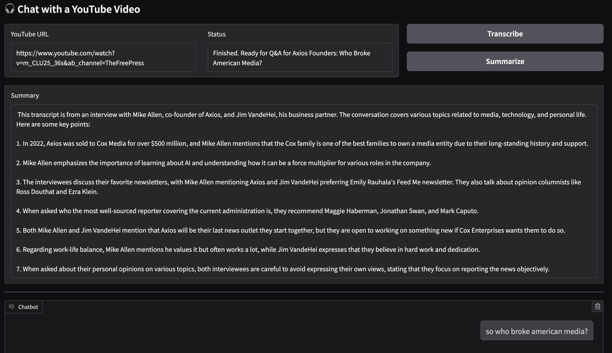
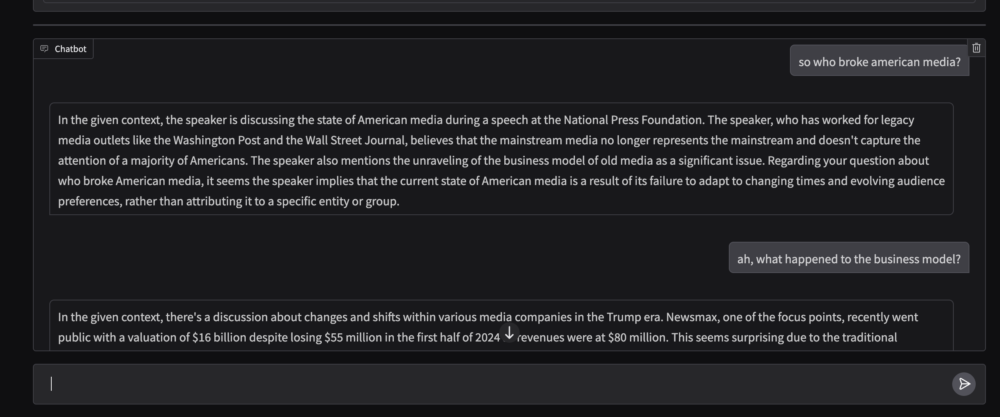
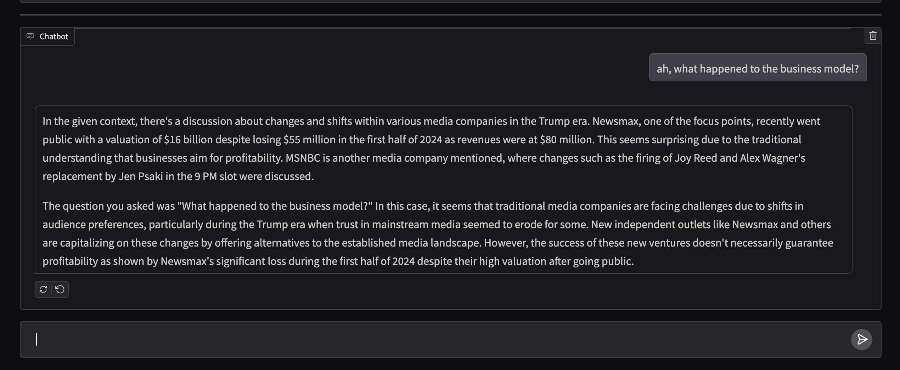

# 🎧 YouTube LLM Q&A (RAG App)

A Retrieval-Augmented Generation (RAG) app that summarizes a YouTube video and lets you ask questions based on the transcript.  
Powered by Whisper, FAISS, and Mistral (via Ollama), with both terminal and web UI options.

---

## 🚀 Installation

Clone the repo and install dependencies:

```bash
git clone https://github.com/zoso95/youtube-llm.git
cd youtube-llm
pip install -r requirements.txt
brew install ollama
```

### To run the terminal version 
```bash
ollama run mistral
python basic_implmentation.py 
```

### To run the gradio server version 
```bash
ollama run mistral
python basic_implmentation.py 
```
Now find the server at http://127.0.0.1:7860/

## Demo 




